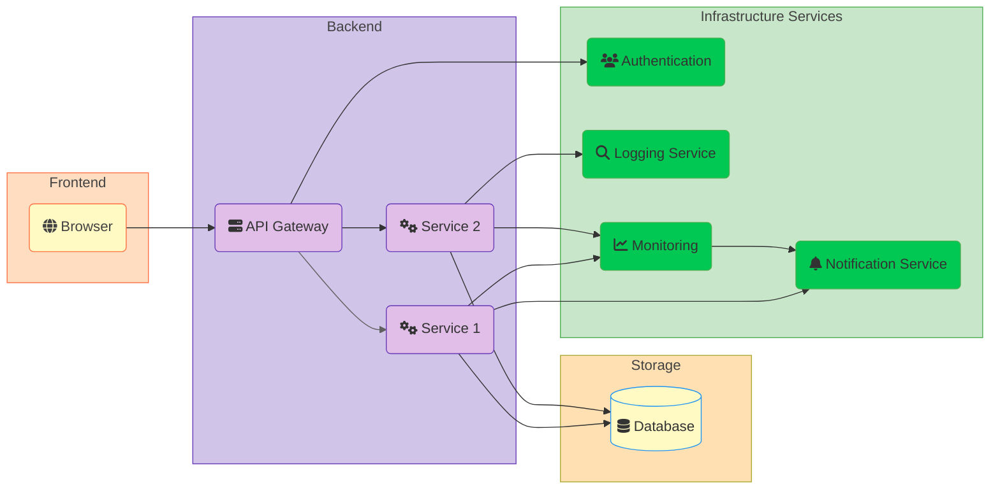

# Project Architecture

> Replace this with a brief introduction to the architecture documentation

[Architecture Diagram](#architecture-diagram) | [Components](#components) | [Data Flow](#data-flow) 

## Architecture Diagram
> Provide a high level architecture diagram in the [Mermaid](https://mermaid.js.org/intro/getting-started.html) format

## Components
> Provide a brief explanation of the main components and their interactions as shown in the diagram <bove>

### Frontend

> Describe the frontend components and their roles in the system.

### Backend

> Detail the backend architecture including APIs and microservices.

### Storage

> Explain the storage solutions used and their configurations.

### Infrastructure Services

> List and describe additional services such as authentication and monitoring.

## Data Flow

> Illustrate how data moves through the system from input to output.