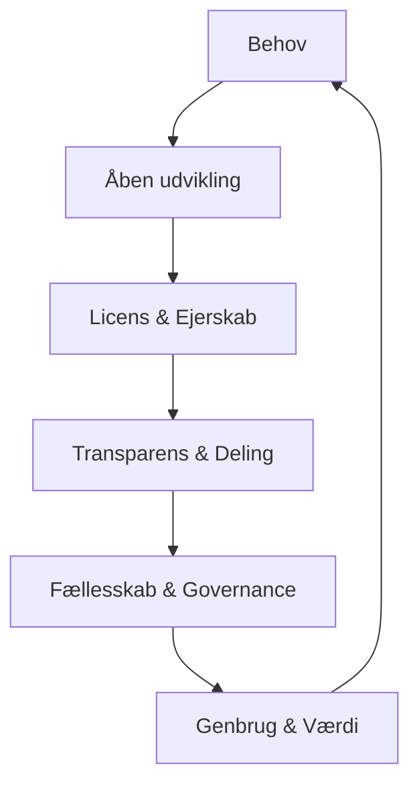

# 🧭 Open Source – modellen for moderne offentlig digitalisering  
### *Fra kode til samarbejdsmodel*

Open source er ikke bare en teknisk tilgang – det er en **organisationsform**, hvor software udvikles, ejes og forvaltes i fællesskab.  
Den bygger på fem grundelementer, som tilsammen skaber **kontrol, transparens og genbrug** i offentlig digitalisering.

---

## ⚙️ Open Source som model

---

## 🔑 Centrale principper

| Element | Beskrivelse |
|----------|-------------|
| **Åben udvikling** | Udvikling foregår i det åbne, så alle kan følge og bidrage. |
| **Licens og ejerskab** | Offentlige aktører bevarer ejerskabet via OSI-godkendte open source-licenser. |
| **Transparens og deling** | Al dokumentation, backlog og beslutninger er offentligt tilgængelige. |
| **Fællesskab og governance** | Projekter styres gennem åbne styregrupper og fælles processer fremfor leverandørbinding. |
| **Genbrug og værdi** | Når én udvikler, kan mange genbruge. Ressourcer bruges bedre, og kvaliteten øges. |

---

## 💡 Hvorfor det virker i det offentlige

- **Effektivitet:** Samme investering kan skabe værdi på tværs af myndigheder.  
- **Kontrol:** Ingen leverandørafhængighed – det offentlige ejer koden.  
- **Sikkerhed:** Åbenhed giver bedre kvalitetssikring og hurtigere fejlrettelser.  
- **Innovation:** Fælles udvikling frigør idéer og kompetencer.  
- **Bæredygtighed:** Bygger på deling, dokumentation og vedvarende fælles vedligehold.  

---

## 🏛️ OS2 – et eksempel i praksis

OS2-fællesskabet samler **80+ offentlige myndigheder**, der deler udvikling, governance og ejerskab på mere end 25 digitale løsninger.  
Modellen viser, hvordan open source kan **institutionaliseres** gennem faste licenser, processtandarder, fælles backlog og åben styring.

---

📎 *Denne one-pager kan anvendes som beslutningsoplæg, introduktionsslide eller strategisk overblik over open source som model for offentlig digitalisering.*
